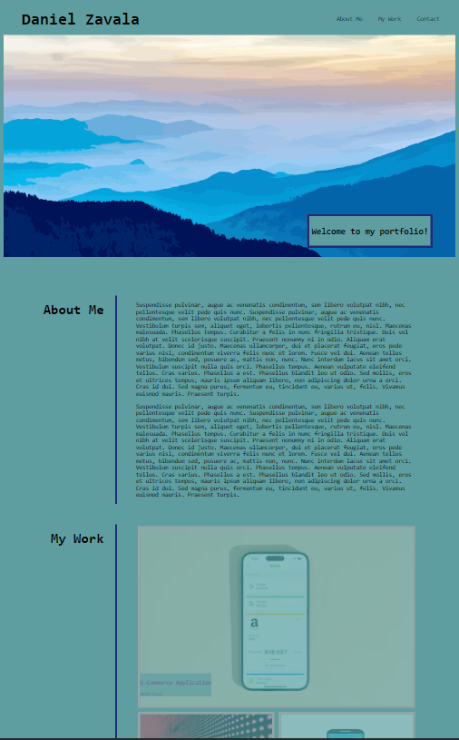

# Daniel's Portfolio

## Description

This is my personal portfolio with previous works completed. An emploer can view samples of my works to help assess my potential for the position. 

-This portfolio includes my name, links to the "about me", "my works", and "contact" sections.

## Sample
 

## Credits
[Professional README Guide](https://coding-boot-camp.github.io/full-stack/github/professional-readme-guide)

[GitHub README syntax](https://docs.github.com/en/get-started/writing-on-github/getting-started-with-writing-and-formatting-on-github/basic-writing-and-formatting-syntax)

[W3Schools CSS Tutorial](https://www.w3schools.com/css/default.asp)

[UNC Charlotte Bootcamp - Week 2 Challenge](https://git.bootcampcontent.com/UNC-Charlotte/UNCC-VIRT-FSF-PT-07-2023-U-LOLC/-/tree/main/02-Advanced-CSS/02-Challenge?ref_type=heads)

## Deployed Application

[Daniel's Portfolio](https://develepor-dan.github.io/Personal-Portfolio/)

[GutHub Repository](https://github.com/Develepor-Dan/Personal-Portfolio)